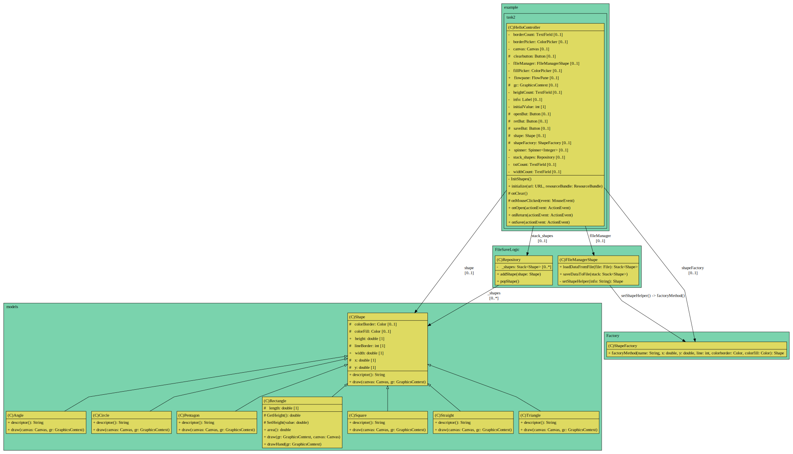
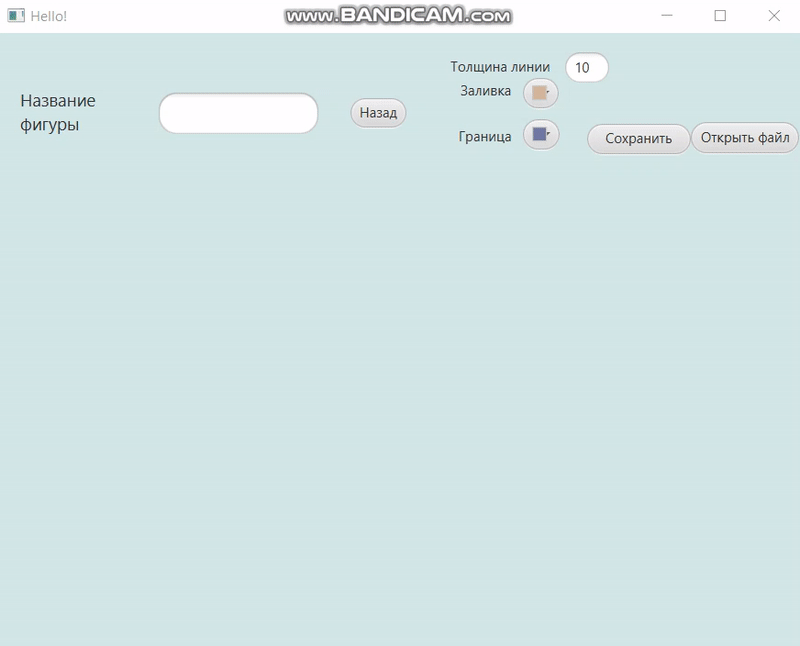

# Task 2 - Фабричный метод с добавлением фигуры в стек и запись ее в файл и его чтение

## Условие задачи
Требуется написать программу, которая рисует фигуру по заданному пользователем названию, создает очередь из фигур и позволяет добавлять/удалять фигуры из очереди. Организовать запись и чтение из файла.

<details>
    <summary><ins><b>Теоретическая справка</b></ins></summary>
    <p>
        <b>Фабричный метод</b> — это порождающий паттерн проектирования, который определяет общий интерфейс для создания объектов в суперклассе, позволяя подклассам изменять тип создаваемых объектов 
    </p>
    <p>
        Для того чтобы система оставалась независимой от различных типов объектов, паттерн <b>Factory Method</b> использует механизм полиморфизма — классы всех конечных типов наследуют от одного абстрактного базового класса, предназначенного для полиморфного использования. В этом базовом классе определяется единый интерфейс, через который пользователь будет оперировать объектами конечных типов.
    </p>
    <p>
        Для обеспечения относительно простого добавления в систему новых типов паттерн <b>Factory Method</b> локализует создание объектов конкретных типов в специальном классе-фабрике. Методы этого класса, посредством которых создаются объекты конкретных классов, называются фабричными.
    </p>
<hr/>
  
</details>

## Выполнение задания

> [!IMPORTANT]
> Реализация интерфейса `Creator`:

```java
public interface Creator {
    public Shape factoryMethod(String name, double x, double y, int line, Color colorborder, Color colorfill) ;
}

public class ShapeFactory implements Creator {
    @Override
    public Shape factoryMethod(String name, double x, double y, int line, Color colorborder, Color colorfill ){
        if(Objects.equals(name, "Пятиугольник")){
            return new  Pentagon(line, colorborder, colorfill, x, y);
        }
        else if(Objects.equals(name, "Квадрат")){
            return new Square(line, colorborder, colorfill, x, y);
        }
        else if(Objects.equals(name, "Треугольник")){
            return new Triangle(line, colorborder, colorfill, x, y);
        }
        else if(Objects.equals(name, "Угол")){
            return new Angle(x,y,line, colorborder, colorfill);
        }
        else if (Objects.equals(name, "Линия") ||Objects.equals(name, "Прямая")){
            return new Straight(line, colorborder, colorfill, x, y);
        }
        else if(Objects.equals(name, "Круг")){
            return new Circle(line, colorborder, colorfill, x, y);
        }
        else{
            return null;
        }
    }
}
```

> [!IMPORTANT]
> Реализация интерфейса `IFileManager`:
```java
public interface IFileManager<T> {
    public void saveDataToFile(Stack<T> stack) throws FileNotFoundException;

    public Stack<T> loadDataFromFile(File file);
}
```
> [!IMPORTANT]
> Реализация интерфейса `IRepository`:
```java
public interface IRepository {
    public void addShape(Shape shape);
    public void popShape();
    public void setShape(Stack<Shape> stack);
    public Stack<Shape> getStackShapes();
}
```
> [!IMPORTANT]
> Реализация класса `FileManagerShape`:
> ```java
> public class FIleManagerShape implements IFileManager<Shape> {

    @Override
    public void saveDataToFile(Stack<Shape> stack) throws FileNotFoundException {
        String name = LocalTime.now().toString().replace(':','_').replace('.','_');
        try (FileOutputStream fileOutputStream = new FileOutputStream("file" + name + ".txt");
             PrintStream printStream = new PrintStream(fileOutputStream)){
            for (var item: stack) {
                printStream.println(item.toString());
            }
        }
        catch (IOException ex) {
            throw new RuntimeException(ex);
        }
    }

    @Override
    public Stack<Shape> loadDataFromFile(File file) {
        try (FileInputStream fileInputStream = new FileInputStream(file);
             InputStreamReader inputStreamReader = new InputStreamReader(fileInputStream, StandardCharsets.UTF_8)) {

            Stack<Shape> shapes = new Stack<Shape>();
            ArrayList<String> items = new ArrayList<>();
            StringBuilder lines = new StringBuilder();

            int count;

            while ((count = inputStreamReader.read()) != -1){
                if ((char)count == '\n'){
                    items.add(lines.toString());
                    lines = new StringBuilder();
                }
                else lines.append((char) count);
            }

            try {
                for (var item: items) {
                    shapes.push(this.setShapeHelper(item));
                }
                return shapes;
            }
            catch (Exception exception){
                System.out.println(exception.toString());
            }
        }
        catch (Exception exception) {
            System.out.println(exception.toString());
        }
        return null;
    }

    private Shape setShapeHelper(String info){
        var args = info.split(" ");

        return new ShapeFactory().factoryMethod(args[0],Double.parseDouble(args[1]),Double.parseDouble(args[2]), (int)Double.parseDouble(args[3]),
                Color.valueOf(args[4].replace('\r',' ').trim()), Color.valueOf(args[5].replace('\r',' ').trim()));
    }
}
> ```
> > [!IMPORTANT]
> Реализация класса `Repository`:
> ```java
> public class Repository implements IRepository {
    private Stack<Shape> _shapes;
    public Repository(){
        _shapes = new Stack<>();
    }
    @Override
    public void addShape(Shape shape){
        _shapes.push(shape);
    }
    @Override
    public void setShape(Stack<Shape> stack) {_shapes = stack;}
    @Override
    public void popShape(){
        if (_shapes.empty()) return;
        _shapes.pop();
    }
    @Override
    public Stack<Shape> getStackShapes() {
        if (this._shapes ==null) this._shapes=new Stack<>();

        return this._shapes;
    }
}
> ```
> [__Содержимое класса контроллера__](src/main/java/com/example/task2/HelloController.java) `HelloController`

> [__Содержимое класса приложения__](src/main/java/com/example/task2/HelloApplication.java) `HelloApplication`

- [__Реализация клаcса__](src/main/java/models/Shape.java) `Shape`
- [__Реализация класcа__](src/main/java/models/Circle.java) `Circle`
-  [__Реализация класcа__](src/main/java/models/Angle.java) `Angle`
-   [__Реализация класcа__](src/main/java/models/Straight.java) `Straight`
-    [__Реализация класcа__](src/main/java/models/Pentagon.java) `Pentagon`
- [__Реализация клаcса__](src/main/java/models/Square.java) `Square`
- [__Реализация клаcса__](src/main/java/models/Triangle.java) `Triangle` 

## Диаграмма UML
> [!NOTE]
> Диаграмма классов `models`:



## Результат выполнения

> [!IMPORTANT]
> __Демонстрация работоспособности приложения__:


