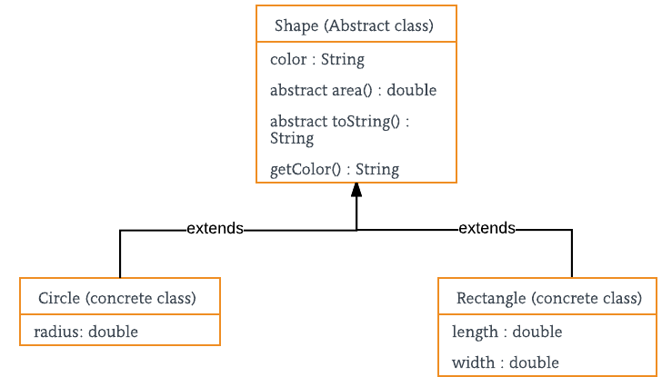

# Task 1 - Абстрактный суперкласс

## Условие задачи
__Разрабатывается система автоматизированного проектирования__. Базовым типом каждой  для каждой детали или строительной конструкции является __«форма»__, и каждая форма имеет цвет, размер, идентификатор и другие характеристики. Все наследуемые конкретные типы фигур - __блок__, __кирпич__, __стена__ и прочие., могут иметь дополнительные характеристики и поведение. Их характеристики могут дополняться, а  поведение может отличаться, например, _формула вычисления площади_ поверхности каждой конкретной  фигуры, ее _отображение_ - различно. Иерархия типов воплощает в себе как сходства, так и различия между формами.



1. Разработайте __пользовательский интерфейс__ в соответствии с представленной расскадровкой
2. Создайте __абстрактный суперкласс__.
```java
abstract class Shape  { 
    //параметры фигуры - приватные поля
    protected Color color; 
    protected double x, y;
    // объявление абстрактных методов
    abstract double area(); 

    abstract void draw( GraphicsContext gr);   

    // конструктор
    public Shape(Color color) { 
        System.out.println("Shape constructor called"); 
        this.color = color;     
    } 
    // реализация методов
    public void setColor(Color color) { this.color=color; } 
} 
```
3. __Реализуйте конкретные классы__ для каждой фигуры
4. Реализуйте __обработчик__ для каждой кнопки графического интерфейса, __выполняющий рисование соответствующей фигуры__.
```java
public void onClick(ActionEvent actionEvent) {
    GraphicsContext graphicsContext = canvas.getGraphicsContext2D();

    Rectangle rectangle=new Rectangle(colorpicker.getValue(), 100, 50);

    rectangle.draw(graphicsContext);
    System.out.println(rectangle.toString());
}
```
5. Дополнительный функционал:
    - заливка фигуры и контура разными цветами;
    - изменение размера фигуры;
    - указание места для отображения фигуры;
    - вывод названия последней нарисованной фигуры;

<details>
    <summary><ins><b>Теоретическая справка</b></ins></summary>
    <p>
        <b>Наследование</b> - Общая логика связанных классов определяется в суперклассе. 
        Варианты поведения, зависящие от конкретного наследника, размещаются в методах с одинаковой сигнатурой и эти методы абстрактные.
    </p>
    <p>
        <b>Abstract Superclass</b>. Класс, выступающий в этой роли, представляет собой абстрактный суперкласс, в котором инкапсулирована общая логика связанных классов. Связанные классы расширяют этот класс. Таким образом, они могут наследовать его методы. Методы с одинаковыми сигнатурами и общей логикой для всех связанных классов помещаются в суперкласс, поэтому логика этих методов может наследоваться всеми подклассами данного суперкласса. Методы с зависящей от конкретного подкласса данного суперкласса логикой, но с одинаковыми сигнатурами, объявляются в абстрактном классе как абстрактные методы, тем самым гарантируя, что каждый конкретный подкласс будет иметь методы с такими же сигнатурами.
    </p>
    <p>
        <b>ConcreteClass1, ConcreteClass2 и т.д</b>. Класс, выступающий в этой роли, представляет собой конкретный класс, чья логика и назначение связаны с другими конкретными классами. Методы, общие для этих связанных классов, помещаются в абстрактный суперкласс.
    </p>
<hr/>
    
</details>

## Выполнение задания

> [!IMPORTANT]
> Реализация класса `Shape`:

```java
public abstract class Shape {
    //параметры фигуры - приватные поля
    protected double lineBorder;
    protected Color colorBorder;
    protected Color colorFill;
    protected double x, y;
    protected double x1, y1;
    protected double x2, y2;
    public double height;
    abstract void SetHeight(double value);
    abstract double GetHeight();
    // объявление абстрактных методов
    abstract double area();
    public abstract void draw(GraphicsContext gr, Canvas canvas);
    public abstract void drawHand(GraphicsContext gr);
    // конструктор
    public Shape(Color colorBorder, Color colorFill, double lineBorder, double x, double y) {
        System.out.println("Shape constructor called");
        this.colorFill = colorFill;
        this.colorBorder = colorBorder;
        this.lineBorder = lineBorder;
        this.x = x;
        this.y = y;
    }
    // реализация методов
    public Color getColorBorder() {
        return this.colorBorder;
    }
    public void setColorBorder(Color color) {
        this.colorBorder = color;
    }
    public Color getColorFill() {
        return this.colorFill;
    }
    public void setColorFill(Color color) {
        this.colorFill = color;
    }
    public double getX() {
        return x;
    }
    public void setX(double x) {
        this.x = x;
    }
    public double getY() {
        return y;
    }
    public void setY(double y) {
        this.y = y;
    }
    public double getX1() {
        return x1;
    }
    public void setX1(double x1) {
        this.x1 = x1;
    }
    public double getY1() {
        return y1;
    }
    public void setY1(double y1) {
        this.y1 = y1;
    }
    public double getX2() {
        return x2;
    }
    public void setX2(double x2) {
        this.x2 = x2;
    }
    public double getY2() {
        return y2;
    }
    public void setY2(double y2) {
        this.y2 = y2;
    }
}
```

> [__Содержимое класса контроллера__](src/main/java/com/example/task1/HelloController.java) `HelloController`

> [__Содержимое класса приложения__](src/main/java/com/example/task1/HelloApplication.java) `HelloApplication`

- [__Реализация класса__](src/main/java/models/Circle.java) `Circle`
- [__Реализация класса__](src/main/java/models/Rectangle.java) `Square`
- [__Реализация класса__](src/main/java/models/Triangle.java) `Triangle` 

## Диаграмма UML
> [!NOTE]
> Диаграмма классов `models`:


## Результат выполнения

> [!IMPORTANT]
> __Демонстрация работоспособности приложения__:


